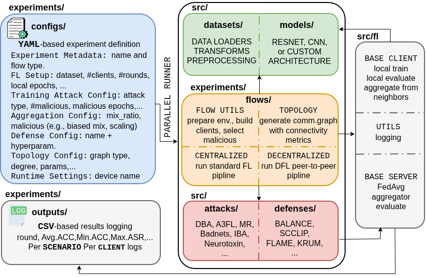

# BackDFL: Modular Framework for Backdoor Attacks and Defenses in (Decentralized) Federated Learning

BackDFL is a **modular, extensible, and configuration-driven** framework for benchmarking **backdoor attacks** and **defenses** in **Decentralized Federated Learning (DFL)**.

It integrates state-of-the-art attacks and defenses, configurable communication topologies, as well as reproducible FL/DFL pipelines.  
The framework is implemented in **Python + PyTorch** and released under the **MIT License**.

---

##  I. Overview

BackDFL offers:

- A **layered architecture** covering configuration, data/model, experiment flows, attacks/defenses, and evaluation.
- **Parallel and decentralized training** with graph-based communication.
- Rich libraries of attacks, defenses, and model architectures.
- Full YAML-based configuration for reproducible experiments.
- Automatic logging, metrics, and graph visualization.

<p align="center">
  
</p>

---

## II. Key Features

### **Modular Design**
Each component—datasets, models, attacks, defenses, flows—is isolated and easily extendable.

### **Configuration-Driven Execution**
All experiments are defined using a **unique** YAML file, removing the need for duplicate boilerplate code.

### **FL + DFL Support**
- Standard centralized FL  
- Fully decentralized FL (peer-to-peer) with controllable graph topologies  

### **Extensive Attack & Defense Support**
- Targeted backdoor attacks: BadNets, DBA, Model Replacement, A3FL, IBA…  
- Untargeted poisoning attacks: Label Flipping, Feature Attack, Gauss Attack, Krum, Trim…  
- Comprehensive defense suite: 15 defenses, including BALANCE, SCCLIP, Krum, WeakDP, FLAME, DeepSight, and other FL and DFL-specific robust methods  
- Benchmarks & models: 6 datasets (MNIST, FEMNIST, CIFAR-10, GTSRB, Fashion-MNIST, HAR) with standard CNN and ResNet architectures.  

### **Evaluation Metrics**
- Accuracy  
- Attack Success Rate (ASR)  
- Durability  
- Graph statistics (degree, spectral gap, connectivity)  
- Logs and visualization for iterative experiments  

---


## III. Getting Started

### **1. Install Dependencies**
```bash
pip install -r requirements.txt
```

### 2. Prepare Datasets

Datasets are automatically downloaded on first use.  
Alternatively, place them in the `data/` folder.

### 3. Run an Experiment

First, set up the experiment by editing the `base_template.yml` file with your desired configuration (num_clients, num_rounds, num_malicious, topology, etc.).

Then, you can run a single experiment with:

```bash
./run_experiment.sh "$ATTACK" "$DEFENSE" "$DATASET" "$FLOW"

#Example
./run_experiment.sh a3fl flame cifar10 decentralized
```

### 4. Loop Over Experiments to Reproduce Results

To run multiple experiments in sequence and reproduce our benchmark results, use:

```bash
./loop_over_experiments.sh
```

This script iterates over predefined configurations, creates temporary YAML files for each experiment, and executes them automatically.
All outputs and logs will be saved in their respective folders: `experiments/outputs/` and `experiments/logs/`

### Contributing

We welcome contributions! Please open an issue or pull request.
