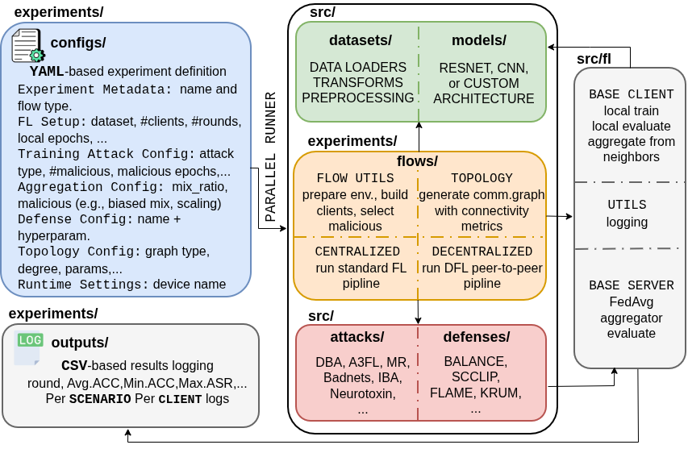

# BackDFL: A Modular Framework for Backdoor Attacks and Defenses in Decentralized Federated Learning


<p align="center">
  <b>BackDFL</b> is a modular, extensible, and configuration-driven framework for evaluating backdoor attacks and defenses in Centralized Federated Learning (CFL) and Decentralized Federated Learning (DFL).
</p>


<p align="center">
  <a href="https://arxiv.org/abs/2608.21137">
    
  </a>
  <a href="https://github.com/mohaminemed/BackDFL">
    
  </a>
</p>


---

## 1. Overview

BackDFL provides a unified experimental framework for benchmarking backdoor attacks and defenses under configurable CFL and DFL settings.

The framework combines:

* **Modular architecture** spanning configuration, data/model handling, experiment flows, attacks, defenses, and evaluation.
* **Centralized and decentralized training**, including peer-to-peer communication over configurable graph topologies.
* **A broad collection of backdoor attacks and robust aggregation/defense mechanisms**.
* **YAML-based experiment configuration** for reproducible and systematic evaluations.
* **Automated logging and evaluation** of task performance, attack effectiveness, robustness, and graph properties.
* **Reproducible experiment pipelines** for running individual configurations or complete benchmark suites.

The framework is implemented in **Python** using **PyTorch**.

<p align="center">
  
</p>

---

## 2. Key Features

### Modular Design

BackDFL separates the main components of a CFL/DFL experiment:

```text
Configuration
    │
    ├── Dataset 
    ├── Model
    ├── Training Flow
    ├── Attack
    ├── Defense
    └── Communication Topology
```

Each component can be independently configured or extended without modifying the rest of the experimental pipeline.

### Configuration-Driven Execution

Experiments are specified through YAML configuration files, including parameters such as:

* number of clients;
* number of malicious clients;
* number of communication rounds;
* dataset and model;
* attack and attack window;
* defense and its parameters ;
* data heterogeneity;
* communication topology;
* training parameters.

This allows the same experimental pipeline to be reused across different attack, defense, dataset, and topology combinations.

### Centralized and Decentralized FL

BackDFL supports:

* **Centralized Federated Learning (CFL)**;
* **Decentralized Federated Learning (DFL)**;
* peer-to-peer client communication;
* configurable graph topologies;
* topology-aware evaluation.

### Reproducible Evaluation

The framework records experiment outputs and logs, making it possible to reproduce individual configurations or execute predefined benchmark suites.

---

# 3. Attacks and Defenses

## Backdoor Attacks

BackDFL implements several representative backdoor strategies covering different attack mechanisms, including static triggers, distributed triggers, optimized triggers, generative triggers, gradient manipulation, model replacement, and layer-targeted attacks.

| Attack | Trigger / Mechanism | Update Manipulation | Activation |
| ----------------- | ---------------------------------------------------- | -------------------------------------------------- | ------------------- |
| **BadNets** | Fixed input-space trigger | Naive poisoned training | Configurable window |
| **DBA** | Distributed trigger components | Naive poisoned training | Configurable window |
| **A3FL** | Optimized trigger using PGD and a hardened surrogate | Naive or scaled model update | Configurable window |
| **IBA** | Learned input-conditioned trigger generator | Naive poisoned training | Configurable window |
| **Neurotoxin** | Fixed trigger + parameter-importance masking | Suppresses gradients on high-importance parameters | Configurable window |
| **LayerPoison** | Fixed trigger + backdoor-critical layer selection via LSA | Selective layer-wise model poisoning | Configurable window |
| **LayerFlip** | Fixed trigger + backdoor-critical layer selection via LSA | Sign flipping on critical layers | Configurable window |
| **Model Scaling** | Fixed trigger | Scaled model update / model replacement | One-shot |

The attacks can be configured with parameters such as poisoning rate, target class, malicious training epochs, attack window, trigger configuration, and update scaling.

### Attack Dimensions

The implemented attacks cover four main dimensions:

| Dimension               | Examples                                                     |
| ----------------------- | ------------------------------------------------------------ |
| **Trigger design**      | Fixed, distributed, optimized, generated                     |
| **Optimization scope**  | None, global model, hardened surrogate, parameter importance |
| **Update manipulation** | Naive training, gradient masking, update scaling             |
| **Activation**          | Persistent attack window or one-shot attack                  |

---

## Defenses

The evaluated defenses are organized into two families.

### DFL Byzantine-Robust Aggregation

These methods are designed for decentralized peer-to-peer aggregation:

| Defense      | Main Signal                               | Update Treatment                      | Aggregation              |
| ------------ | ----------------------------------------- | ------------------------------------- | ------------------------ |
| **UBAR**     | Distance + local loss                     | Shortlisting and loss-based filtering | Mean                     |
| **SCCLIP**   | Update-delta norm                         | Random bucketing + clipping           | Mean of clipped deltas   |
| **BALANCE**  | $\ell_2$ distance                         | Hard accept/reject                    | Mean of accepted updates |
| **ABALANCE** | $\ell_2$ distance + temporal statistics   | Adaptive accept/reject                | Mean of accepted updates |
| **DFL-Dual** | Model-space + data-space distances        | Two-stage clustering                  | Selected contributors    |
| **Sentinel** | Cosine similarity + local validation loss | Filtering, weighting, normalization   | Weighted aggregation     |

### FL Backdoor Defenses Adapted to DFL

These defenses originate from centralized FL and are instantiated locally by each DFL client acting as an aggregator:

| Defense                     | Detection Signal                     | Update Treatment              | Aggregation          |
| --------------------------- | ------------------------------------ | ----------------------------- | -------------------- |
| **DeepSight**               | NEUP, DDif, cosine similarity        | HDBSCAN + median clipping     | FedAvg               |
| **FLAME**                   | Last-layer cosine similarity         | HDBSCAN + clipping + noise    | Weighted FedAvg      |
| **SPP**                     | Partial-parameter similarity         | Hard filtering                | FedAvg               |
| **MMAD**                    | $\ell_1$, $\ell_2$, cosine distances | Score-based selection         | FedAvg               |
| **Norm Clipping / Weak-DP** | Update norm                          | Clipping + optional noise     | Weighted FedAvg      |
| **Multi-Krum**              | Pairwise update distances            | Select lowest-scoring updates | Mean                 |
| **Trimmed-Mean**            | Coordinate-wise values               | Coordinate-wise trimming      | Coordinate-wise mean |

The benchmark therefore covers defenses based on:

* distance;
* similarity;
* local loss;
* clustering;
* update clipping;
* adaptive thresholds;
* weighting;
* coordinate-wise robust aggregation.

---

# 4. Evaluation Metrics

BackDFL reports multiple complementary metrics to characterize both utility and attack effectiveness.

### DFL Task Performance

* **Min.ACC** — minimum test accuracy observed accross benign clients.
* **Avg.ACC** — average test accuracy accross benign clients.

### DFL Backdoor Effectiveness

* **Max.ASR** — maximum attack success rate observed during the attack/evaluation period.
* **Final.ASR** — maximum attack success rate at the end of the experiment.
* **Durability** — a.k.a Lifespan: number of clean rounds (attack is off) required for ASR to fall below a specified threshold (e.g., 0.5).

### DFL Topology

For decentralized experiments, BackDFL can additionally record graph-level properties such as:

* node degree;
* graph connectivity;
* spectral gap;

### Experiment Artifacts

Experiments automatically generate:

* configuration files;
* logs;
* metrics;
* serialized results;
* plots and graph visualizations.

---

# 5. Benchmark Configurations

The benchmark covers multiple datasets and model architectures with standardized training settings.

| Dataset        | Model       | Classes | Target $y_T$             | Input               | Optimizer | $\eta$ | Batch | Epochs | Rounds |
| -------------- | ----------- | ------: | ------------------------ | ------------------- | --------- | -----: | ----: | -----: | -----: |
| `MNIST`        | SimpleCNN   |      10 | 7 — digit *7*            | $1\times28\times28$ | SGD       |   0.01 |    32 |      1 |     50 |
| `FashionMNIST` | FashionCNN  |      10 | 7 — sneaker              | $1\times28\times28$ | SGD       |   0.01 |    32 |      5 |     50 |
| `FEMNIST`      | LeNet-5     |      62 | 7 — digit *7*            | $1\times28\times28$ | SGD       |   0.01 |    32 |     10 |    100 |
| `CIFAR-10`     | ResNet18-GN |      10 | 7 — horse                | $3\times32\times32$ | SGD       |   0.01 |    32 |      5 |    100 |
| `CIFAR-100`    | ResNet18-GN |     100 | 7 — beetle               | $3\times32\times32$ | SGD       |   0.01 |    32 |      5 |   600* |
| `GTSRB`        | GTSRB-CNN   |      43 | 7 — 100 km/h speed limit | $3\times32\times32$ | SGD       |   0.01 |    32 |      5 | 50–100 |
| `HAR`          | HAR-MLP     |       6 | 1 — walking upstairs     | 561                 | SGD       |   0.01 |    32 |      5 | 50–300 |
| `NSL-KDD`      | NSLKDD-MLP  |       5 | 0 — normal traffic       | 122                 | SGD       |   0.01 |    32 |      5 |    200 |
| `UNSW-NB15`    | UNSW-MLP    |      10 | 0 — normal traffic       | 199                 | SGD       |   0.01 |    32 |      5 |    100 |

* 500 benign rounds followed by 100 rounds from the benign checkpoint with a scheduled attack.

### Target-Class Selection

The target classes are fixed per dataset to ensure consistent and reproducible evaluation across attacks.

For datasets with semantic class labels, the selected targets correspond to concrete, well-defined classes rather than being chosen dynamically during evaluation. In particular:

* **GTSRB — class 7 (`100 km/h speed limit`)**: The 100 km/h speed-limit sign is selected as the target because misclassifying another sign as a higher speed limit represents a safety-relevant failure mode in traffic-sign recognition.
* **NSL-KDD and UNSW-NB15 — class 0 (`normal traffic`)**: targeting the benign/normal class evaluates whether a backdoor can cause malicious or anomalous traffic to be classified as legitimate traffic. The resulting attack represents a **false-negative classification scenario**, not simply confusing one attack category with another.
* **HAR — `walking upstairs`**: the selected activity provides a concrete target label in a multi-class human-activity recognition task.
* **CIFAR-10 / CIFAR-100 / MNIST / FashionMNIST**: targets are fixed class indices to provide a common and reproducible targeted-backdoor setting across experiments.


---

# 6. Getting Started

## 6.1 Set Up a Virtual Environment

We recommend using a dedicated Python virtual environment.

```bash
python3 -m venv venv
source venv/bin/activate

# Windows:
# venv\Scripts\activate
```

## 6.2 Install Dependencies

```bash
pip install -r requirements.txt
```

## 6.3 Prepare the Datasets

Datasets are automatically downloaded when supported by the corresponding dataset loader.

Alternatively, datasets can be placed in:

```text
data/
```

---

# 7. Running an Experiment

Configure the experiment through:

```text
base_template.yml
```

Typical parameters include:

```yaml
num_clients:
num_rounds:
num_malicious:
dataset:
model:
attack:
defense:
flow:
topology:
```

A single experiment can then be launched with:

```bash
./run_experiment.sh "$ATTACK" "$DEFENSE" "$DATASET" "$FLOW"
```

For example:

```bash
./run_experiment.sh a3fl flame cifar10 decentralized
```

The same execution interface can be used to combine different attacks, defenses, datasets, and FL/DFL flows.

---

# 8. Reproducing Benchmark Experiments

To execute the predefined benchmark configurations:

```bash
./loop_over_experiments.sh
```

The script iterates over the predefined configurations, generates the corresponding temporary YAML files, and executes the experiments automatically.

Results are stored under:

```text
experiments/
├── outputs/
└── logs/
```

This makes it possible to reproduce complete experiment suites without manually modifying individual configuration files.

---

# 9. Repository Structure

A simplified view of the repository is:

```text
BackDFL/
├── attacks/              # Backdoor and poisoning attacks
├── defenses/             # Aggregation and defense mechanisms
├── datasets/             # Dataset loading and partitioning
├── models/               # Model architectures
├── flows/                # CFL / DFL training flows
├── configs/              # YAML configurations
├── experiments/          # Experiment outputs and logs
├── scripts/              # Experiment automation
├── base_template.yml     # Base experiment configuration
├── run_experiment.sh     # Run one experiment
├── loop_over_experiments.sh
├── requirements.txt
└── BackDFL.png
```

---

# 10. 📄 Paper

If you use **BackDFL** in your research, please cite:

```bibtex
@misc{bouchiha2026backdflunifiedbenchmarkbackdoor,
      title={BackDFL: A Unified Benchmark for Backdoor Attacks and Defenses in Decentralized Federated Learning},
      author={Mouhamed Amine Bouchiha and Gregory Blanc and Yufei Han},
      year={2026},
      eprint={2608.21137},
      archivePrefix={arXiv},
      primaryClass={cs.LG},
      url={https://arxiv.org/abs/2608.21137}
}
```

---

# 12. Contributing

Contributions are welcome.

If you would like to report a bug, suggest an improvement, add an attack or defense, or contribute a new dataset/model integration, please open an **issue** or submit a **pull request**.
